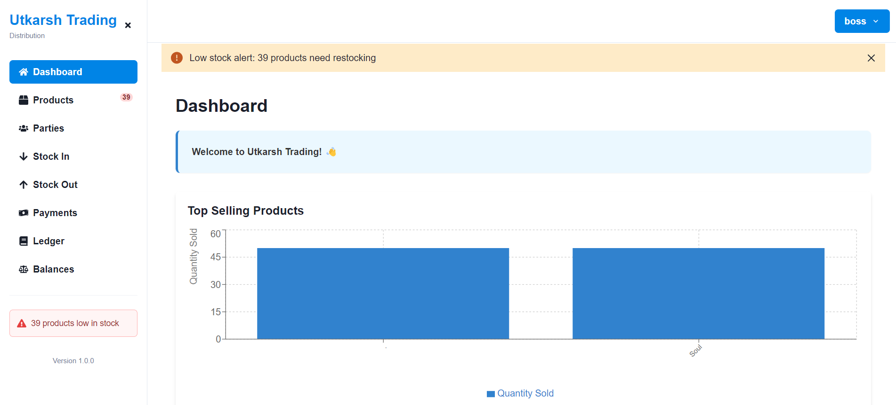
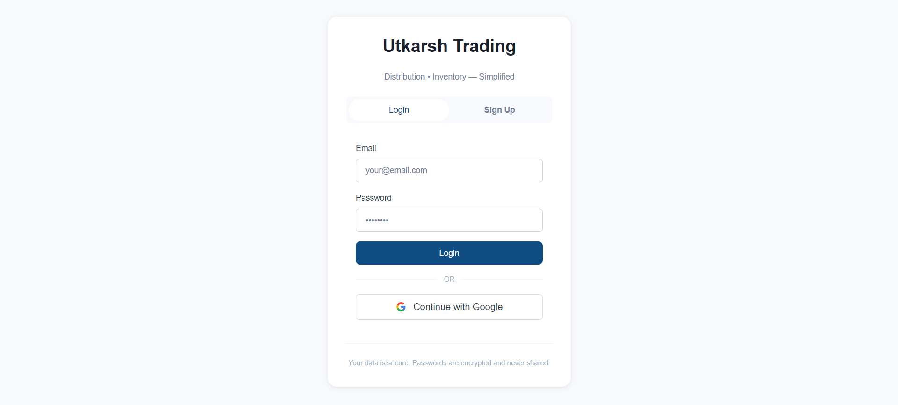
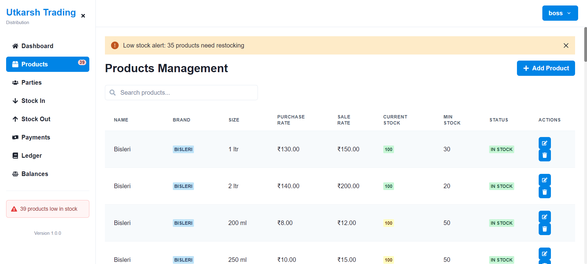
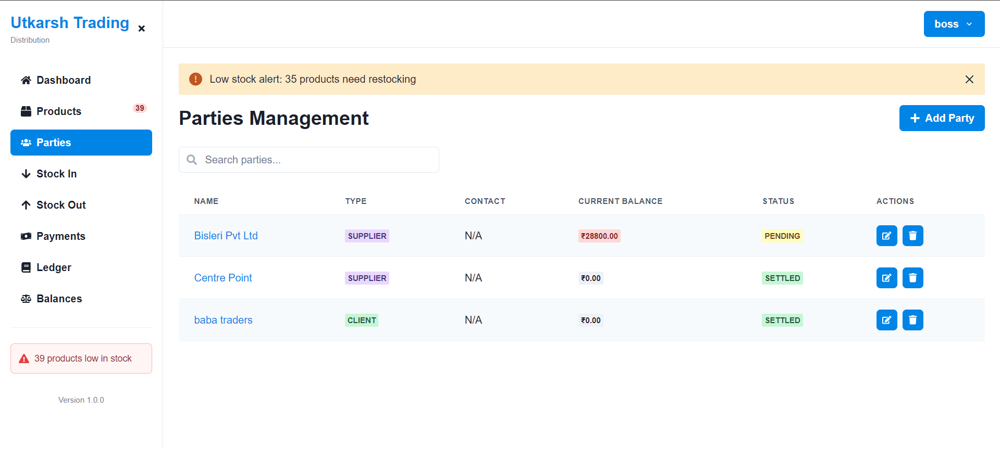
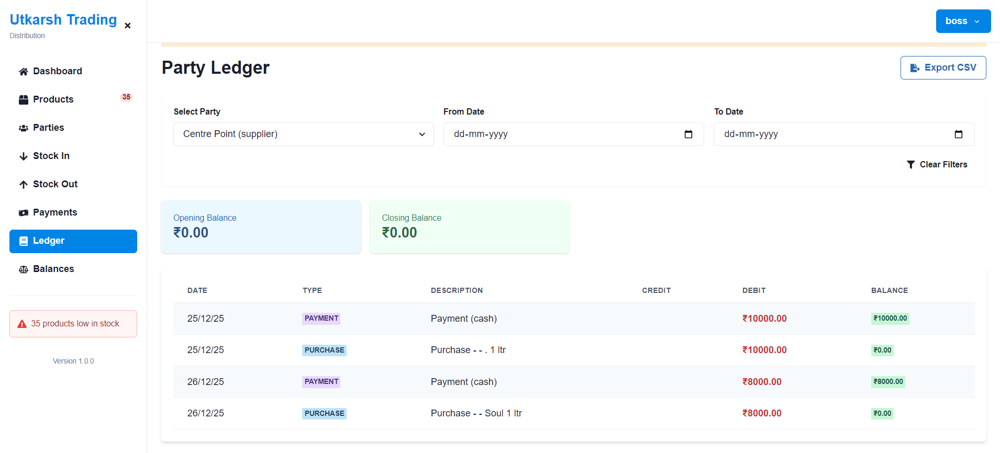
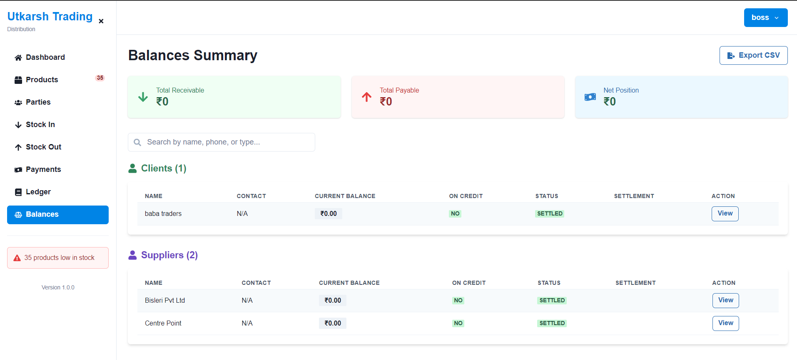

# StockFlow ERP  
### Cloud-Native Multi-Tenant Distribution Management System

StockFlow ERP is a **production-grade, cloud-hosted ERP platform** built for **water and beverage distributors**.  
It provides **secure authentication**, **Google OAuth**, **multi-tenant data isolation**, and **complete inventory & ledger management**.

The system follows **real-world SaaS architecture patterns** used by modern ERP products.

---

## 🌐 Live Deployment

- **Frontend (Vercel)**  
  https://stock-flow-erp.vercel.app

- **Backend API (Render)**  
  https://stockflow-erp.onrender.com

---

## 📸 Screenshots

| Dashboard | Login |
|-----------|-------|
|  |  |

| Inventory | Parties |
|-----------|---------|
|  |  |

| Ledger | Payments |
|--------|----------|
|  |  |

---

## 🧩 Core Capabilities

### 🔐 Authentication & Identity
- Email + Password login (JWT)
- Google OAuth 2.0 (Passport.js)
- Persistent login across refresh
- Secure token-based authorization
- Protected routes & session handling

### 👥 Multi-Tenant System Design
- Each user operates in **complete data isolation**
- No shared records across users
- User-scoped access enforced at **database query level**
- Enterprise-style tenant separation using `user_id`

### 📦 Product & Inventory Management
- Predefined **product template** for new users
- Automatic product availability on first login
- Purchase rate, sale rate & stock thresholds
- Live stock tracking

### 🤝 Parties (Clients & Suppliers)
- Client & supplier separation
- Opening balances
- Contact & address management

### 📒 Ledger & Balances
- Debit / Credit ledger
- Partial payments
- Outstanding balance calculation
- Historical transaction view

### 📊 Stock Transactions
- Stock IN / OUT
- Invoice & party linkage
- Product-wise inventory updates

### 💳 Payments
- Cash & Online payment modes
- Real-time balance updates
- Payment history tracking

---

## 🏗 System Architecture

### High-Level Architecture Diagram

```
┌────────────────────────┐
│      Frontend          │
│   React + Chakra UI    │
│ (Vercel Deployment)    │
└───────────▲────────────┘
            │ HTTPS (JWT)
            │
┌───────────┴────────────┐
│      Backend           │
│   Node.js + Express    │
│ Passport.js (OAuth)    │
│  JWT Authentication    │
│ (Render Deployment)    │
└───────────▲────────────┘
            │ SSL
            │
┌───────────┴────────────┐
│   PostgreSQL DB        │
│  Multi-Tenant Schema   │
│  user_id Isolation     │
│  (Neon Cloud DB)       │
└────────────────────────┘
```

### Architecture Highlights
- Frontend communicates **only via API**
- OAuth handled **exclusively on backend**
- JWT issued by backend, stored on frontend
- Database enforces **user-level isolation**
- Fully cloud-native & stateless backend

---

## 🛠 Technology Stack

### Frontend
- React + Vite
- Chakra UI
- React Router
- JWT-based auth handling
- Vercel hosting

### Backend
- Node.js
- Express.js
- Passport.js (Google OAuth)
- JWT Authentication
- Render hosting

### Database
- PostgreSQL (Neon)
- Indexed schema
- SSL-enforced connections
- Multi-tenant design

---

## 🗂 Project Structure

```
water-distribution-system/
├── backend/
│   ├── routes/
│   │   ├── auth.js
│   │   ├── products.js
│   │   ├── parties.js
│   │   ├── stock.js
│   │   ├── payments.js
│   │   ├── ledger.js
│   │   └── dashboard.js
│   ├── middleware/
│   │   └── auth.js
│   ├── config/
│   │   └── passport.js
│   ├── migrations/
│   ├── db.js
│   ├── server.js
│   ├── package.json
│   └── .env
│
├── desktop-app/
│   ├── src/
│   │   ├── screens/
│   │   │   ├── Login.jsx
│   │   │   ├── Dashboard.jsx
│   │   │   ├── Products.jsx
│   │   │   ├── Parties.jsx
│   │   │   ├── Ledger.jsx
│   │   │   ├── Payments.jsx
│   │   │   ├── Balances.jsx
│   │   │   ├── StockIn.jsx
│   │   │   ├── StockOut.jsx
│   │   │   └── OAuthSuccess.jsx
│   │   ├── components/
│   │   ├── assets/
│   │   ├── api/
│   │   ├── App.jsx
│   │   └── main.jsx
│   ├── vite.config.js
│   ├── package.json
│   └── .env
│
├── README.md
└── .gitignore
```

---

## 🔄 Google OAuth Flow

```
1. User clicks "Continue with Google"
   ↓
2. Redirects to backend /api/auth/google
   ↓
3. Google authentication popup
   ↓
4. User selects account
   ↓
5. Backend validates credentials
   ↓
6. JWT generated securely
   ↓
7. Redirect to /oauth-success?token=...
   ↓
8. Token stored in localStorage
   ↓
9. App state updated
   ↓
10. User redirected to dashboard ✅
```

---

## 🚀 Local Development

### Backend Setup

```bash
cd backend
npm install
npm run dev
```

Server runs on `http://localhost:5001`

### Frontend Setup

```bash
cd desktop-app
npm install
npm run dev
```

Frontend runs on `http://localhost:5173`

### Database Setup

1. Create PostgreSQL database
2. Run migrations:
   ```bash
   cd backend
   node runMigrations.js
   ```
3. Seed sample data (optional):
   ```bash
   node seed.js
   ```

---

## 🔐 Security Practices

✅ OAuth secrets **never exposed** to frontend  
✅ JWT-based **stateless authentication**  
✅ **SQL injection-safe** parameterized queries  
✅ **User-scoped database access** at query level  
✅ **HTTPS enforced** in production  
✅ **Secure password hashing** with bcrypt  
✅ **CORS properly configured**  
✅ **Token expiration** (7 days)  

---

## 🧪 API Endpoints

### Authentication
- `POST /api/auth/register` - Create account
- `POST /api/auth/login` - Email/password login
- `GET /api/auth/google` - Google OAuth initiate
- `GET /api/auth/google/callback` - Google OAuth callback
- `GET /api/auth/me` - Get current user

### Products
- `GET /api/products` - List products
- `POST /api/products` - Create product
- `PUT /api/products/:id` - Update product
- `DELETE /api/products/:id` - Delete product

### Parties
- `GET /api/parties` - List parties
- `POST /api/parties` - Create party
- `GET /api/parties/:id/balance` - Get party balance
- `GET /api/parties/:id/ledger` - Get party ledger

### Stock
- `POST /api/stock/in` - Stock entry
- `POST /api/stock/out` - Stock exit
- `GET /api/stock/current` - Current inventory
- `GET /api/stock/low-stock` - Low stock alerts

### Ledger & Payments
- `GET /api/ledger/:party_id` - Party ledger
- `POST /api/payments` - Record payment
- `GET /api/payments/:party_id` - Party payments

---

## 📈 Future Enhancements

- [ ] Role-based access control (Admin / Staff / Viewer)
- [ ] PDF invoice generation
- [ ] Analytics & reporting dashboard
- [ ] Mobile-first responsive design
- [ ] Audit logs for compliance
- [ ] Refresh token rotation
- [ ] Two-factor authentication (2FA)
- [ ] Real-time notifications
- [ ] Bulk CSV import/export
- [ ] Multi-currency support

---

## 🤝 Contributing

Contributions are welcome! Please follow these steps:

1. Fork the repository
2. Create a feature branch (`git checkout -b feature/YourFeature`)
3. Commit changes (`git commit -m 'Add YourFeature'`)
4. Push to branch (`git push origin feature/YourFeature`)
5. Open a Pull Request

---

## 📝 License

This project is licensed under the MIT License.

---

## 👤 Author

**Utkarsh Jain**  
Full-Stack Developer | SaaS | Cloud Architecture

---

## 📧 Support

For issues, questions, or feature requests, please open an issue on GitHub or contact the development team.

---

**Built with ❤️ for distribution businesses**
